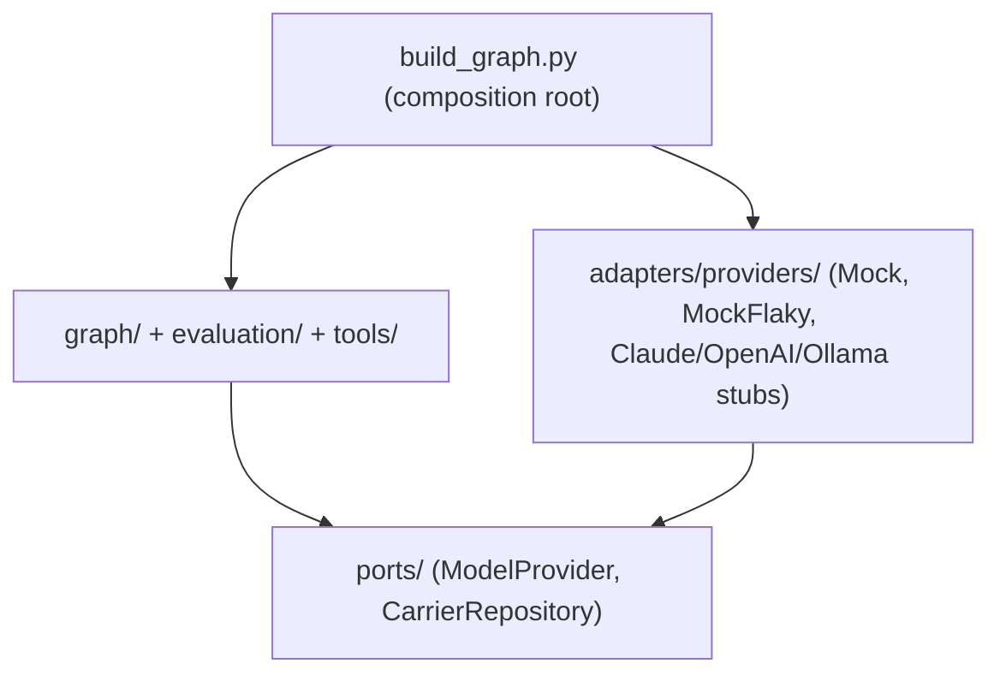
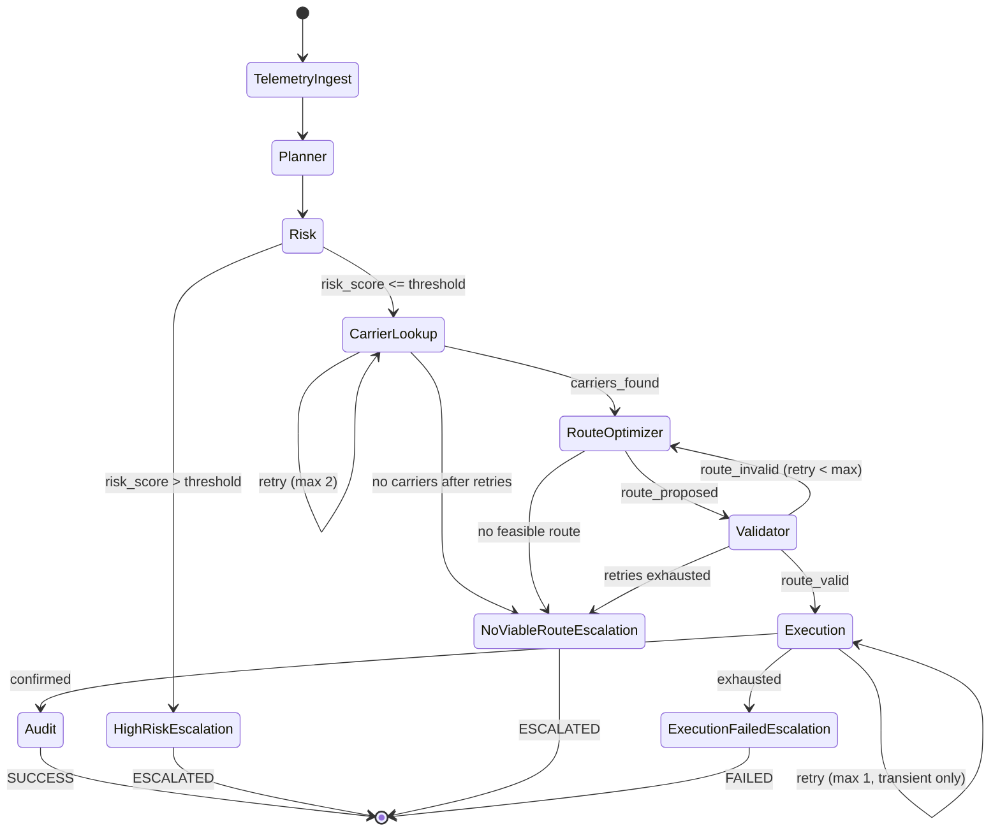

# Agentic Logistics Eval

Autonomous carrier-rerouting agent, built on **LangGraph**, with a **trajectory-based evaluation harness** comparing a frontier closed-source model against a leading open-source model — implemented entirely with deterministic, offline mock providers (no paid APIs, no API keys, no `.env` files).

## Table of Contents

1. [Overview](#overview)
2. [Architecture](#architecture)
3. [The Business Workflow](#the-business-workflow)
4. [Quick Start](#quick-start)
5. [Evaluation Framework Summary](#evaluation-framework-summary)
6. [Model Comparison Summary](#model-comparison-summary)
7. [Swapping in a Real Provider Later](#swapping-in-a-real-provider-later)
8. [Project Structure](#project-structure)
9. [Testing](#testing)
10. [Future Roadmap](#future-roadmap)
11. [Decision Log](#decision-log)
12. [License](#license)

## Overview

Given a telemetry alert describing a logistics disruption (port congestion, carrier failure, weather delay, customs hold), this system autonomously plans a response, assesses risk, finds and validates an alternative carrier/route, executes the reroute, and writes an immutable audit record — escalating to a human queue instead of guessing whenever risk is high or no viable route exists.

Every run is scored not just on whether it succeeded, but on the full **trajectory**: planning quality, tool selection, tool-call correctness, state transitions, error recovery, retry count, hallucination, task completion, latency, and cost.

## Architecture

Hexagonal (Ports & Adapters): `graph/`, `evaluation/`, and `tools/` depend only on the abstract interfaces in `ports/` — never on a concrete provider. Swapping the model that powers this system means writing one new adapter class and registering it in `graph/build_graph.py`'s factory. See [`docs/architecture.md`](docs/architecture.md) for the full rationale and diagram.



This boundary is enforced by a test, not just a convention: `tests/regression/test_architecture_boundaries.py` fails the build if a guarded package ever imports a concrete provider directly.

## The Business Workflow



Full diagram source: [`docs/diagrams/state_machine.mmd`](docs/diagrams/state_machine.mmd). Sequence-level walkthrough: [`docs/diagrams/sequence_reroute.mmd`](docs/diagrams/sequence_reroute.mmd).

### Sample walkthrough

`scenarios/scenario_02_carrier_failure.json` describes a carrier failure on the EU-WEST → US-EAST lane. Under the `mock_flaky` provider, the first carrier-lookup tool call is deliberately malformed (missing a required argument); the graph retries automatically, the second attempt succeeds, and the pipeline proceeds to a validated, executed, audited `SUCCESS` — with the retry fully visible in the resulting trajectory.

## Quick Start

### Replit
Click **Run**. `run.sh` installs dependencies and runs a demo scenario — no keys needed, nothing to configure.

### Local
```bash
python -m venv .venv && source .venv/bin/activate
pip install -e ".[dev]"

# Run one scenario and print its full trajectory
python -m agentic_logistics.cli demo --scenario scenario_01_port_congestion.json --provider mock

# Run the full evaluation harness across all scenarios and both mock providers
python -m agentic_logistics.cli eval

# Print the compiled graph structure
python -m agentic_logistics.cli graph

# Run the test suite
pytest
```

Or via `make`: `make demo`, `make eval`, `make test`, `make lint`.

## Evaluation Framework Summary

Ten dimensions, each a pure function of a `Trajectory`, scored 0–4 against a rubric, combined into a weighted composite front-loaded toward safety (task completion + error recovery = 50% of the score). Full spec: [`docs/evaluation_framework.md`](docs/evaluation_framework.md).

Sample output (`python -m agentic_logistics.cli eval`):

| Provider | Scenarios | Mean Composite | Success Rate | Escalation Rate | Mean Retries |
|---|---|---|---|---|---|
| `mock` | 5 | 3.80 | 80% | 20% | 0.40 |
| `mock_flaky` | 5 | 3.78 | 80% | 20% | 0.80 |

## Model Comparison Summary

**Claude** (frontier, closed) vs. **Qwen2.5-Instruct** (leading open-source) — full write-up in [`docs/research_report.md`](docs/research_report.md). Headline: open-source is plausibly production-ready today for the schema-constrained, validator-backed steps (carrier lookup, route optimization); the frontier model is recommended for the judgment-heavy steps with no downstream validator (risk assessment, planning under ambiguous alerts) until a fine-tuned open model demonstrates measured parity there.

## Swapping in a Real Provider Later

1. Implement `ModelProvider.plan()` and `.decide_tool_call()` in a new adapter under `adapters/providers/` (see the docstrings in `claude_provider_stub.py`, `openai_provider_stub.py`, `ollama_provider_stub.py` for exactly what each integration involves).
2. Register the new class in `graph/build_graph.py`'s `_PROVIDER_FACTORY` dict.
3. Pass `--provider <name>` to the CLI, or add it to `evaluation/run_eval.py`'s `DEFAULT_PROVIDERS`.

No changes are needed anywhere in `graph/nodes/`, `evaluation/`, or `tools/`.

## Project Structure

```
agentic-logistics-eval/
├── docs/                     # architecture, evaluation framework, research report, decision log, diagrams
├── presentation/             # Marp-compatible product strategy deck
├── src/agentic_logistics/
│   ├── domain/                # pure models + errors, zero I/O
│   ├── ports/                  # ModelProvider, CarrierRepository abstract interfaces
│   ├── adapters/
│   │   ├── providers/          # MockProvider, MockProviderFlaky, Claude/OpenAI/Ollama stubs
│   │   └── data/                # JSON fixture-backed carrier repository
│   ├── tools/                 # carrier_lookup, route_optimizer, risk_scorer, route_validator, execution_simulator + registry
│   ├── graph/                  # LangGraph nodes, edges, and the build_graph.py composition root
│   ├── evaluation/            # Trajectory/Step schema, metrics, scorer, judge, run_eval CLI
│   ├── config/                 # plain settings, no secrets
│   └── cli.py
├── scenarios/                # 5 golden scenario JSON fixtures with ground truth
├── tests/                     # unit / workflow / evaluation / regression tiers
└── reports/                   # generated eval reports + audit logs (gitignored contents)
```

## Testing

Four tiers, all under `pytest`:

- **Unit** (`tests/unit/`): domain model validation, individual tool functions, mock-provider determinism, metric functions against hand-built toy trajectories.
- **Workflow** (`tests/workflow/`): runs the real compiled graph — happy path, retry-then-succeed, and no-viable-route escalation.
- **Evaluation** (`tests/evaluation/`): end-to-end scorecard generation and full-harness runs.
- **Regression** (`tests/regression/`): locked golden composite scores per (scenario, provider) pair, plus the architecture-boundary import check — any silent drift fails CI.

```bash
make test              # everything
make test-unit
make test-workflow
make test-eval
make test-regression
```

## Future Roadmap

- Real `claude`/`ollama` (Qwen2.5) adapters wired in behind the existing stubs — zero changes needed outside `adapters/providers/`.
- LLM-as-judge layer (`evaluation/judge.py::llm_as_judge_hook`) on top of the structural metrics, for qualitative reasoning-trace review.
- Multi-agent split: a dedicated risk sub-agent with access to richer historical disruption data.
- Process-mining pass over production trajectories to discover edge cases beyond the five hand-written scenarios shipped here.
- Fine-tuning the open model on historical reroute-decision data to close the planning/hallucination gap identified in the research report.

## Decision Log

See [`docs/decision_log.md`](docs/decision_log.md) for an honest, specific account of what was AI-generated vs. hand-designed, what was accepted as-is, and what was corrected (with the actual bugs found and fixed) during this repository's construction.

## License

MIT (or your preferred license — update this section before submitting).
