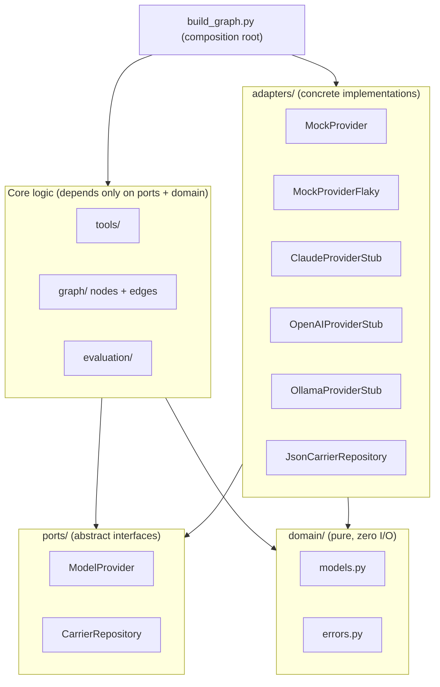

# Architecture

## Why Ports & Adapters (Hexagonal)

The hard constraint driving every architectural choice in this repo is: **swap the model provider by changing one class.** That requirement *is* the Ports & Adapters pattern by definition — define an abstract `Port` (`ports/model_provider.py`), and let concrete `Adapters` (`MockProvider`, `MockProviderFlaky`, and the `ClaudeProviderStub` / `OpenAIProviderStub` / `OllamaProviderStub`) implement it.

A second, equally important reason: **evaluation must be provider-agnostic.** If `evaluation/metrics.py` reached into provider-specific fields, we could never honestly compare two models. Because `graph/`, `evaluation/`, and `tools/` depend only on `ports/`, the evaluation harness works identically no matter which adapter produced the trajectory it's scoring.

## The one enforced rule

Code under `graph/nodes/`, `graph/edges.py`, `graph/state.py`, `evaluation/`, and `tools/` **must never import from `adapters/providers/*`**. The only exception is `graph/build_graph.py`, which is explicitly the composition root — the one place a concrete provider is chosen, via a plain string/enum, never an environment variable.

This boundary isn't just a convention — it's enforced by `tests/regression/test_architecture_boundaries.py`, which greps the guarded packages for forbidden imports and fails the build if the seam ever rots.

## Swapping in a real provider later

1. Implement `ModelProvider.plan()` and `.decide_tool_call()` in a real adapter (the stubs in `adapters/providers/{claude,openai,ollama}_provider_stub.py` document exactly what each would do).
2. Register it in `build_graph.py`'s `_PROVIDER_FACTORY` dict.
3. Pass `--provider claude` (or `openai`/`ollama`) to the CLI, or select it in `evaluation/run_eval.py`'s `DEFAULT_PROVIDERS` tuple.

Nothing else changes — not the graph topology, not the tools, not the evaluation metrics.

## Why no `.env` / API keys

The assignment constraints rule out paid APIs entirely for this submission. Rather than half-wire a secrets mechanism that's never exercised, the repo simply doesn't have one: `config/settings.py` contains only plain, non-secret tunables (retry ceilings, risk threshold). Provider selection is a CLI flag. This keeps the repository runnable, offline, and reviewable with zero setup friction on Replit or anywhere else.
